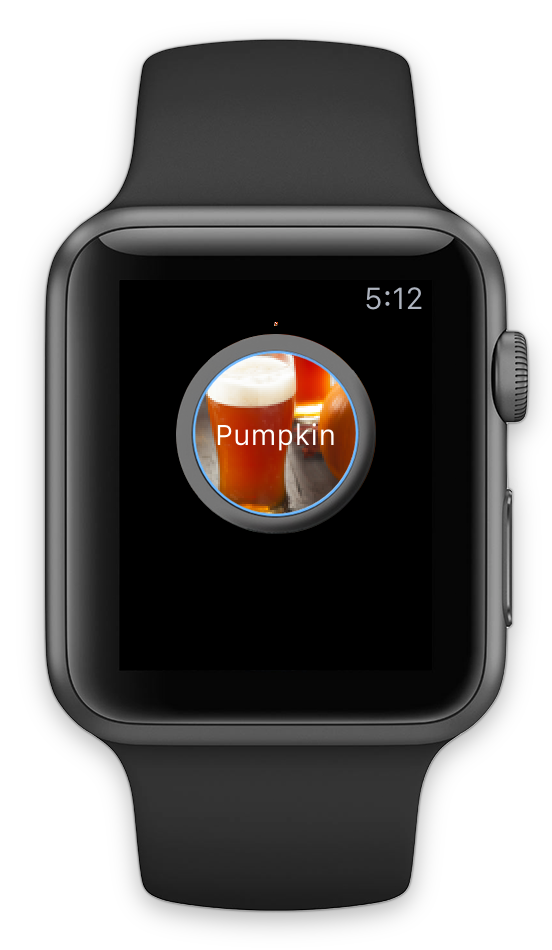
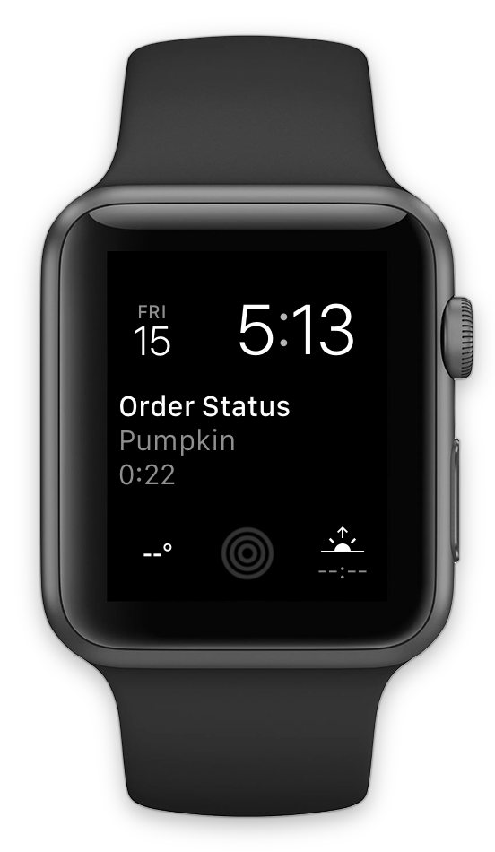
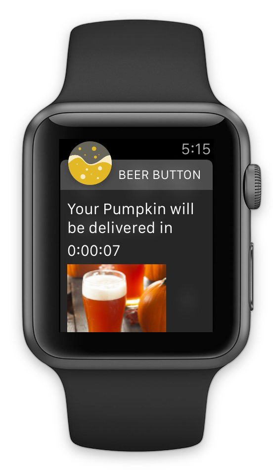

# BeerButton
### Sample app for Developing for Apple Watch Presentation
### Updated for watchOS 3, Beta 6

## Presentation
https://speakerdeck.com/cnstoll/developing-wearable-software-360idev

## Instructions: Be sure to add beer options to order via the parent iPhone app

## Screenshots

## Previously Featured In:
### https://speakerdeck.com/cnstoll/developing-wearable-software
### https://speakerdeck.com/cnstoll/developing-for-apple-watch
